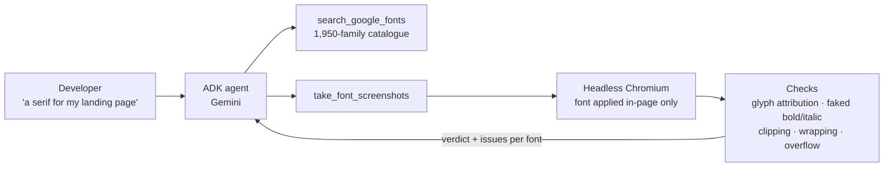

# Font Selection Agent

[](https://github.com/Mariam-Fathi/font-selection-agent/actions/workflows/ci.yml)

An AI agent (Google ADK, Gemini) that helps developers choose a font by **trying
candidates on their real page**, then checking what actually rendered and whether the
layout broke.

It began as my capstone for the **Google × Kaggle 5-Day AI Agents Intensive**. Version 1
took screenshots and assumed they were right. When I measured them, many weren't. The
project is now a study of one question: **can an AI agent be trusted to make a design
decision?** Each part of the agent is checked against a truth that doesn't come from the
agent itself.

**One-page summary for reviewers: [docs/summary.md](docs/summary.md)** ·
**Plan: [docs/roadmap.md](docs/roadmap.md)**

## Findings so far

| Question | Answer | Evidence |
|---|---|---|
| Did v1's screenshots show the font they claimed? | **No, in 81.6% of renders**: faked bold despite a real bold face, or icons turned into words. v1 reported success on all of them. v2: **0%** (95% CI 0–1.0%). | [Case study 1](docs/case-study-rendering.md#finding-1-v1s-screenshots-were-wrong-in-4-of-5-renders-and-v2-caused-none-of-those-errors) |
| Can the checks be trusted? | Planted flaws in 6 types and 4 kinds of control: all 470 development trials pass. On **held-out seeds run once**, 280/280 flaws found and 188/190 controls clean. Glyph checks agree with the catalogue's script data on **234/234** renders. | [Case study 1](docs/case-study-rendering.md#step-1-can-the-checks-be-trusted-plant-flaws-and-see-if-theyre-found) |
| How often does a real font break a real layout? | **4.2%** of renders cut off text, **12%** for handwriting fonts on mobile. Tall fonts overflow fixed-height boxes; wide fonts overflow fixed-width labels. | [Case study 1](docs/case-study-rendering.md#finding-3-real-fonts-break-real-layouts-through-fixed-size-boxes) |
| Can a model judge whether a font *fits*? | Next: Phase 2 (critic) and Phase 3 (pre-registered human study). | [Roadmap](docs/roadmap.md) |

The five test pages are written for the benchmark. The fonts and the browser are real:
every number comes from Chrome rendering real Google Fonts.

## How it works



1. **Search** the full Google Fonts catalogue (a dated snapshot of its public metadata).
   Filter by category, by script support (`subset="arabic"`) and by whether the family
   has a real bold face.
2. **Render** the page once with its own fonts (the baseline) and once per candidate.
   The font is applied inside the browser. **The user's files are never modified.**
   Only the weights and styles the page uses are requested.
3. **Verify** through Chrome DevTools (`CSS.getPlatformFontsForNode`) which font drew
   each glyph, and check whether bold or italic had to be faked.
4. **Check the layout** against the baseline. Look for:
   - text cut off by its container;
   - buttons and labels that wrap;
   - headings that wrap;
   - sideways scrolling;
   - icon fonts that got replaced;
   - a large change in page height.
5. **Report** a verdict per font (`clean`, `warnings`, `broken`), the screenshots and the
   problems in plain words.

| Part | What's in it |
|---|---|
| [`fontagent/`](fontagent) | `catalog.py` (catalogue and lookups), `render.py` (renderer and verification), `checks.py` (font and layout checks), `page.js` (in-page measurement) |
| [`agents/`](agents), [`tools/`](tools) | The ADK agent and its two tools |
| [`benchmark/`](benchmark) | 5 test pages, the planted-flaw benchmark, the real-font audit, analysis |
| [`docs/`](docs) | [Summary](docs/summary.md), [roadmap](docs/roadmap.md), [case study 1](docs/case-study-rendering.md) |
| CI | GitHub Actions: lint, plus offline and network tests in Chromium |

## Run it

You need Python 3.10+ and a [Gemini API key](https://aistudio.google.com/apikey).

```bash
pip install -e ".[dev]"
```
```bash
python -m playwright install chromium
```

Put the key in a `.env` file in the project root:

```
GOOGLE_API_KEY=your_key_here
```

Then start the agent and give it `benchmark/fixtures/landing.html` as the file:

```bash
python agent.py
```

For React, Vue or other frameworks, start your dev server and give the agent its URL.

## Reproduce the benchmark

```bash
python -m benchmark.planted --seeds 10
```
```bash
python -m benchmark.render_audit --per-category 16 --seed 7
```
```bash
python -m benchmark.analyze
```

Results are written to `benchmark/results/`. The report
`benchmark/results/phase1_report.md` is generated, never edited by hand.

## Tests

```bash
pytest
```

Tests marked `browser` need Chromium. Tests marked `network` also need
`fonts.googleapis.com`. Run `pytest -m "not network"` to work offline.
