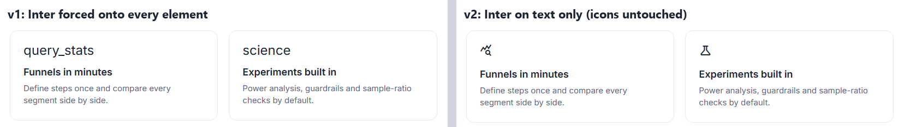
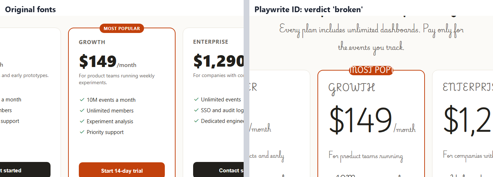

# Case study 1: Does the screenshot show the font it claims to?

**Background.** My capstone for the Google × Kaggle AI Agents Intensive was an agent
that helps developers choose a font. It applied each candidate font to the user's page,
took a screenshot, and let the user compare. Every later step (a model judging the
screenshots, an agent choosing between them) depends on one assumption: **the
screenshot labelled "Lora" really shows Lora.** Before building anything on that, I
tested it.

> The pages in this study are five realistic test pages I wrote (a landing page, a
> pricing page, a dashboard, a bilingual Arabic/English page and the capstone's original
> demo). The fonts and the browser are real: every number comes from Chrome rendering
> real Google Fonts.

## How version 1 worked

| Step | What v1 did | Why that's a problem |
|---|---|---|
| Apply the font | Rewrote the user's source file, then restored it | A crash mid-run leaves the user's code modified |
| Load the font | Requested only the regular (400) weight | Every bold heading and button is a *fake* bold that the browser synthesizes |
| Scope | `* { font-family: X !important }` on every element | Icon fonts get replaced: icons turn into words |
| Wait | Fixed `sleep`s (up to 12 s per font) | Too short means a fallback font is captured; too long is just slow |
| Check | None: a PNG on disk counted as success | Every failure above is silent |

## What I built

- **A renderer that never touches the user's files.** It applies the font inside the
  browser and requests exactly the weights and styles the page uses (from a
  1,950-family catalogue snapshot). It waits for those specific faces to load, not for
  a fixed time.
- **Glyph-level verification.** Chrome DevTools reports which font drew each glyph of
  each element (`CSS.getPlatformFontsForNode`). From this, the renderer can tell when
  text fell back to another font and when bold or italic had to be faked.
- **Layout checks against the original page.** For every text element, it measures
  how many pixels overflow on each axis and how many lines the text takes. It also
  measures whether the page scrolls sideways. The original page is the baseline, so
  only problems the font introduced are reported.

## Step 1: Can the checks be trusted? Plant flaws and see if they're found

A detector that's never been shown to fail is untested. So I wrote a benchmark that
breaks pages in known ways at known elements. Each trial passes only if the detector
reports that problem **at that element**. Control trials change nothing harmful and
must report nothing.

| Planted flaw | How it's planted |
|---|---|
| Clipped text | A button's box is shrunk to half its text width, with overflow hidden |
| Wrapping control | A button with two or more words is narrowed so its text must wrap |
| Sideways scrolling | An element 1.4× the screen width, anchored at the page's start side |
| Font never loads | A font name that doesn't exist |
| Missing glyphs | Arabic text added to an element, set in a Latin-only font |
| Faked bold | An element made bold, with only the regular face loaded |

| Control (must report nothing) | |
|---|---|
| Unchanged page | Rendered twice |
| Wider element | A button given *more* room |
| Arabic-capable font | Arabic text added, set in a font that covers Arabic and Latin |
| Bold face loaded | An element made bold, with the bold face loaded |

### The benchmark found bugs, in the detector and in itself

The first run didn't pass. Each miss had to be explained before changing anything:

| Run | Clipped | Wrapping | Sideways | Arabic control | What I found |
|---|---|---|---|---|---|
| 1 | 16/30 | 24/30 | 40/50 | 30/50 | See below |
| 2 | 33/40 | 40/40 | 40/50 | 50/50 | Two more causes |
| 3 | **40/40** | **40/40** | **50/50** | **50/50** | All 470 trials pass |

(The other flaw types and controls passed in every run. Trial counts grew after run 1
because I gave the bilingual page real `<a>` buttons, so clip and wrap trials could be
planted there too.)

**Two bugs in the detector:**

1. **Nested text was counted twice.** Chrome's font report for an element covers its
   whole subtree. So for a menu link holding an icon and a label, the icon's glyph was
   counted as a "fallback" in the label. Each element now subtracts the glyphs of its
   tagged children. This caused all 20 Arabic-control false alarms.
2. **An invisible overflow masked a real one.** Many real buttons already overflow by
   2px: a 1px border plus a `line-height` equal to the box height. The detector
   treated "clipped" as yes/no and compared it with the original page, so a button
   that was already "clipped" by 2px could never be reported as newly clipped. It now
   compares **pixels of overflow per axis**, with a 2px tolerance.

**Three bugs in the benchmark itself:**

1. Shrinking a button's *box* doesn't guarantee its *text* overflows, because padding
   absorbs the difference. Planted widths are now based on the measured text width.
2. On a flex-layout page, the injected wide element simply shrank, so nothing
   overflowed. It's now absolutely positioned.
3. On the right-to-left Arabic page, content sticking out on the *right* can't be
   scrolled to, so it isn't sideways scrolling. The planted element is now anchored at
   the page's start side.

Each detector fix has a regression test.

### Held-out check

Fixing a detector on the same trials you score it on can overfit. So after run 3, I ran
**10 new seeds (10–19) once, with no changes**:

| | Development seeds 0–9 | Held-out seeds 10–19 |
|---|---|---|
| Planted flaws found (6 types) | 280/280 | 280/280 |
| Controls with no false alarm (4 types) | 190/190 | **188/190** |

The two held-out failures are both Jomhuria, an Arabic-capable font, on the landing
page. The detector reported glyph fallback in the **footer**, not in the element I
planted. I checked: Jomhuria has no glyph for the middle dot (`·`) in
`Privacy · Terms`. **The detector was right and the control's label was wrong:** the
catalogue's "latin" tag doesn't promise every punctuation mark. They still count as
failures, because that's the rule I set before running.

## Step 2: Real fonts on real pages

**Setup.** 120 fonts: the 40 from v1's list plus 80 drawn at random, 16 per category,
from the rest of the catalogue (seed 7). 118 of them are in today's catalogue. The 5
pages, at desktop (1280 px) and mobile (390 px) widths, rendered by both pipelines:
**2,397 renders**. Three more timed out loading the page during a network outage and
are excluded.

### Finding 1: v1's screenshots were wrong in 4 of 5 renders, and v2 caused none of those errors

There are two kinds of problem. Some are caused by the pipeline: the font has the
face, but the screenshot doesn't show it. Others are **real limits of the font**: it
has no bold, or no Arabic. No pipeline can fix those, but the user should be told.

For the 38 fonts from v1's list that are still in the catalogue (380 renders per
pipeline):

| Caused by the pipeline | v1 | v2 |
|---|---|---|
| Bold faked though the family has a bold face | 62.6% | **0%** |
| Italic faked though it has an italic face | 9.5% | **0%** |
| Icons turned into words (pages with icons) | 83.3% | **0%** |
| **Any of these** | **81.6%** (95% CI 77.4–85.2%) | **0%** (95% CI 0–1.0%) |



| A real limit of the font | Renders | v2 told the user | v1 told the user |
|---|---|---|---|
| No bold face, page has bold text | 140 | 100% | never (no checks) |
| No italic face, page has italic text | 40 | 100% | never |
| No Arabic glyphs, page has Arabic | 76 | 100% | never |

Two of v1's 40 fonts are no longer in the catalogue: Fredoka One became Fredoka, and
Source Serif Pro became Source Serif 4. The API still serves the old names, but only in
the regular weight. The v2 tool rejects unknown names and suggests the closest real one.

### Finding 2: the verifier agrees with an independent source

The catalogue lists the scripts each family supports. The verifier never reads it: it
only looks at which font Chrome used for each glyph. On the bilingual page (234
renders), the two agreed on **every render** (234/234, 95% CI 98.4–100%).

The audit also caught a bug in my own renderer. One font, **Molle**, never loaded in
v2. Molle is the only italic-only family in the catalogue, and the renderer asked for
an upright face it doesn't have. It was reported as `font_not_loaded` rather than
silently screenshotted, then fixed (with a regression test) and re-rendered.

The same comparison for faked bold also agrees 100% (1,178 renders). But it is **not
independent**: v2 decides which weights to request *from the catalogue*. So that
agreement mainly shows that faces requested are faces rendered.

### Finding 3: real fonts break real layouts, through fixed-size boxes

In v2, **4.2% of renders** (49/1,178, 95% CI 3.2–5.5%) cut off text, and 22 of 118
fonts broke at least one page.

| Category | Desktop | Mobile |
|---|---|---|
| Handwriting | 7.3% | **12.0%** |
| Serif | 3.5% | 6.1% |
| Display | 1.1% | 3.2% |
| Monospace | 0.0% | 3.0% |
| Sans-serif | 0.8% | 0.8% |

- **Every one of the 49 errors was clipped text** (89 clipped elements in all). No
  button wrapped and no page scrolled sideways. There were two mechanisms:
  - **Height (58 of 89):** fonts with tall ascenders and descenders, mostly
    handwriting, overflow fixed-height boxes, like a two-line plan description.
  - **Width (31 of 89):** wide fonts overflow fixed-width, single-line labels, like
    the "Most popular" badge or a KPI label on the mobile dashboard.
- **Popularity is a weak signal of safety.** The 200 most popular families broke 1.2%
  of renders, the rest 5.3%.



## What this does and doesn't show

- **Five pages I wrote are not the web.** They were built to contain common patterns
  (fixed-size buttons, badges, icon fonts, RTL text), so the breakage rates describe
  these patterns, not websites in general.
- **Overflow is measured in line boxes, not ink.** A 6px vertical overflow may cut
  only empty space below the text. The check says *where to look*. Whether it's
  visible is a judgment, which is the job of the critic in Phase 2.
- **Chrome only**, desktop and one mobile width.
- **Rendering correctly isn't the same as looking good.** A font can pass every check
  and still be wrong for the page. That's the question for Phases 2 and 3.

## Reproduce it

```bash
python -m benchmark.planted --seeds 10
```
```bash
python -m benchmark.planted --seeds 10 --first-seed 10 --name planted_heldout
```
```bash
python -m benchmark.render_audit --per-category 16 --seed 7
```
```bash
python -m benchmark.analyze
```

Every number above is in `benchmark/results/phase1_report.md`, which is generated by
the last command.
